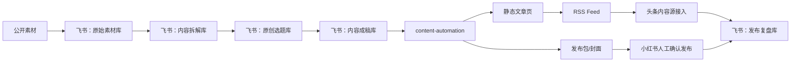

# 中期自动化方案

## 目标

把内容业务从“临时复制粘贴”升级为“飞书内容中台 + 脚本自动编排 + 平台可控发布”。

## 推荐架构

## 平台策略

### 头条

优先尝试官方“内容源接入/RSS”路线。

原因：

- 官方支持内容源定期同步。
- 比模拟浏览器点击更稳定。
- 更适合长期自动化。

当前脚本已经生成：

- `public/articles/*.html`
- `public/rss.xml`

下一步需要：

- 把 `public/` 部署到一个稳定域名。
- 在头条后台申请/配置内容源。
- 确认头条对 RSS 字段、原创声明、封面图、同步频率的实际要求。

官方参考：

- https://mp.toutiao.com/docs/baike/2789/20623/

### 小红书

暂时不做完全无人值守发布。

原因：

- 小红书开放平台主要公开的是分享、电商、商家/服务市场等能力。
- 个人创作者笔记发布没有稳定、公开、通用的官方全自动发布 API。
- 模拟浏览器发布容易遇到验证码、风控、页面改版。

当前策略：

- 自动生成标题、正文、标签、封面图。
- 人工最后确认发布。
- 发布后把链接和数据回填飞书。

官方参考：

- https://agora.xiaohongshu.com/
- https://open.xiaohongshu.com/document/developer/file/4

## 自动化边界

可以自动化：

- 内容采集清单
- 选题拆解
- 草稿生成
- 多平台改写
- 封面生成
- 发布包生成
- RSS/静态站点生成
- 复盘表初始化
- 发布后数据记录

不建议完全自动化：

- 小红书最终发布按钮
- 账号登录/验证码/实名/人脸
- 涉及平台风控的重复批量发布
- 未经审核的大规模自动搬运

## 下一阶段任务

1. 给 `public/` 配一个可访问域名。
2. 优化 RSS 字段，补充封面图、作者、分类。
3. 在头条后台测试内容源接入。
4. 为小红书生成更适合九宫格/单图笔记的图片包。
5. 增加发布后复盘脚本，把链接、阅读量、点赞、收藏、评论回写飞书。
